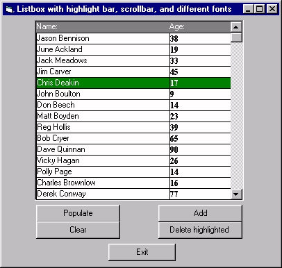



## Multi Font / Color Listbox

### Description

Visual Basic Listbox with highlight and scrollbar. It allows multiple fonts, and different backcolors and forcolors concurrently. This demo uses a mini database to populate the listbox.
 
### More Info
 

             |
---                |---
**Submitted On**   |2000-11-06 18:17:52
**By**             |[Jason Bennison](https://github.com/Planet-Source-Code/PSCIndex/blob/master/ByAuthor/jason-bennison.md)
**Level**          |Intermediate
**User Rating**    |4.0 (20 globes from 5 users)
**Compatibility**  |VB 4\.0 \(32\-bit\), VB 5\.0, VB 6\.0
**Category**       |[Custom Controls/ Forms/  Menus](https://github.com/Planet-Source-Code/PSCIndex/blob/master/ByCategory/custom-controls-forms-menus__1-4.md)
**World**          |[Visual Basic](https://github.com/Planet-Source-Code/PSCIndex/blob/master/ByWorld/visual-basic.md)
**Archive File**   |[CODE\_UPLOAD113791162000\.zip](https://github.com/Planet-Source-Code/jason-bennison-multi-font-color-listbox__1-12579/archive/master.zip)

### API Declarations

no declarations

